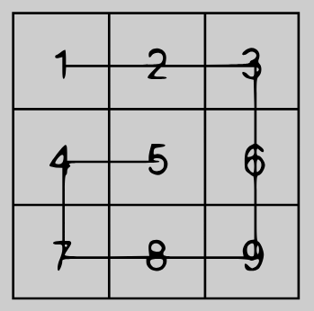

# Snail [4 kyu]

[See Problem] (https://www.codewars.com/kata/521c2db8ddc89b9b7a0000c1)

## Snail Sort
Given an ``n x n array, return the array elements arranged from outermost elements to the middle element, traveling clockwise.

```
array = [[1,2,3],
         [4,5,6],
         [7,8,9]]
snail(array) #=> [1,2,3,6,9,8,7,4,5]
```

For better understanding, please follow the numbers of the next array consecutively:

```
array = [[1,2,3],
         [8,9,4],
         [7,6,5]]
snail(array) #=> [1,2,3,4,5,6,7,8,9]
```


This image will illustrate things more clearly:


NOTE: The idea is not sort the elements from the lowest value to the highest; the idea is to traverse the 2-d array in a clockwise snailshell pattern.

NOTE 2: The 0x0 (empty matrix) is represented as en empty array inside an array `[[]].

## Solution

```
def snail(snail_map):
    print(snail_map)
    layer = 0
    result = []
    while snail_map:
        try:
            middle_end = []
            middle_start = []
            if len(snail_map)>2:
                for row in snail_map[1:-1]:
                    middle_end.append(row.pop(-1))
                for row in snail_map[1:-1]:
                    middle_start.append(row.pop(0))
                
            result += snail_map.pop(0)
            result = result + middle_end
            result += snail_map.pop(-1)[::-1]
            result = result + middle_start[::-1]

        except:
            print(snail_map)
            print(result)
            break

    return result
```